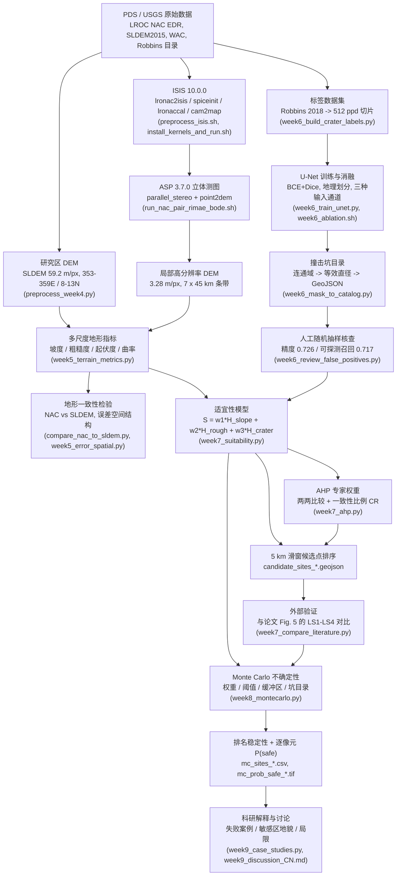

# 工作流总览

从 PDS 原始数据到"候选着陆点排名 + 不确定性区间"的完整链路。
每个方框后面括号里是负责的脚本（完整清单见 [script_index.md](script_index.md)）。

## 数据流要点

1. **两个 DEM 分辨率**：主结果是 59.2 m/px 的 SLDEM；自产 NAC DEM（3.28 m/px）
   只覆盖研究区约 1 %（一条 7 × 45 km 条带），因此分辨率对照（H1）尚未完成。
2. **撞击坑目录是唯一"模型产出"的输入**：它的精度与召回经人工抽样核查后才有资格进入评价，
   否则误差会被误读为地形差异。
3. **阈值与权重都是假设，不是事实**：因此最终交付物是"带区间的候选点排名"，
   而不是一张单一的安全区图。
